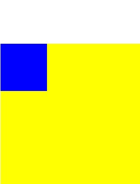

**[공지사항]** 잘못된 정보나 오타에 피드백 주시면 감사하겠습니다.:)
{: .notice--info}

# collapsing margins

인접한 공간에 margin-bottom과 margin-top 속성을 적용할 경우에 두 속성 중 큰 속성값을 병합하는 현상을 말한다.

마진 병합은 상하에서만 일어나는 현상이며, block 요소의 성격을 가진 태그에서만 발생한다.

## 형제간에 발생하는 마진 병합 현상

HTML 태그에 margin-bottom과 margin-top 속성을 적용했을 경우 공백이 큰 속성값을 기준으로 설정되는 것

### 예제

공백이 100px + 50px = 150px이 아닌 100px가 생긴다. 형제간에 큰 값이 작은 값을 병합하는 현상이 일어난다.

```css
#first {
  width: 100%;
  height: 200px;
  background-color: yellow;
  margin-bottom: 100px;
}

#second {
  width: 100%;
  height: 200px;
  background-color: blue;
  margin-top: 50px;
}
```

## 부모와 자식 간에 발생하는 마진 병합 현상

자식의 margin-top 속성이 부모에게 영향을 미친다.

### 예제

자식 영역의 위쪽에만 여백이 100px만큼 생겨야 하지만, 부모인 노란색 박스까지 함께 내려온다. 의도한 대로 하고 싶다면 child 안에 `position: absolute;`을 추가하면 된다.

```css
#parent {
  width: 100%;
  height: 500px;
  background-color: yellow;
}

#child {
  width: 300px;
  height: 300px;
  background-color: blue;
  margin-top: 100px;
}
```



## 해결 방법

parent 요소에 border 속성을 주거나, padding 속성을 주어 해결할 수 있다.

- 빈 table 태그를 넣는다

  ```css
  .parent::before,
  .parent::after {
    content: "";
    display: table;
  }
  ```

- 자식 요소의 display 속성값을 inline-block으로 바꾸기

  자식 요소 간의 병합 현상도 사라진다.

  ```css
  .child {
    display: inline-block;
  }
  ```

- `overflow: hidden;` 속성을 이용하기

  ```css
  .parent {
    overflow: hidden;
  }
  ```

---

출처

- [https://thebook.io/006943/ch03/07/03-08/](https://thebook.io/006943/ch03/07/03-08/)
- [https://velog.io/@ursr0706/%EB%A7%88%EC%A7%84margin](https://velog.io/@ursr0706/%EB%A7%88%EC%A7%84margin)
